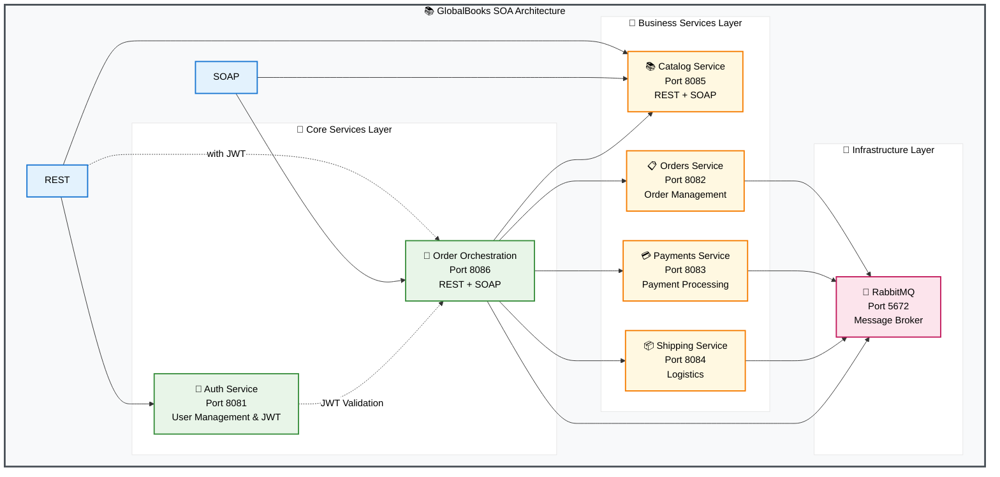
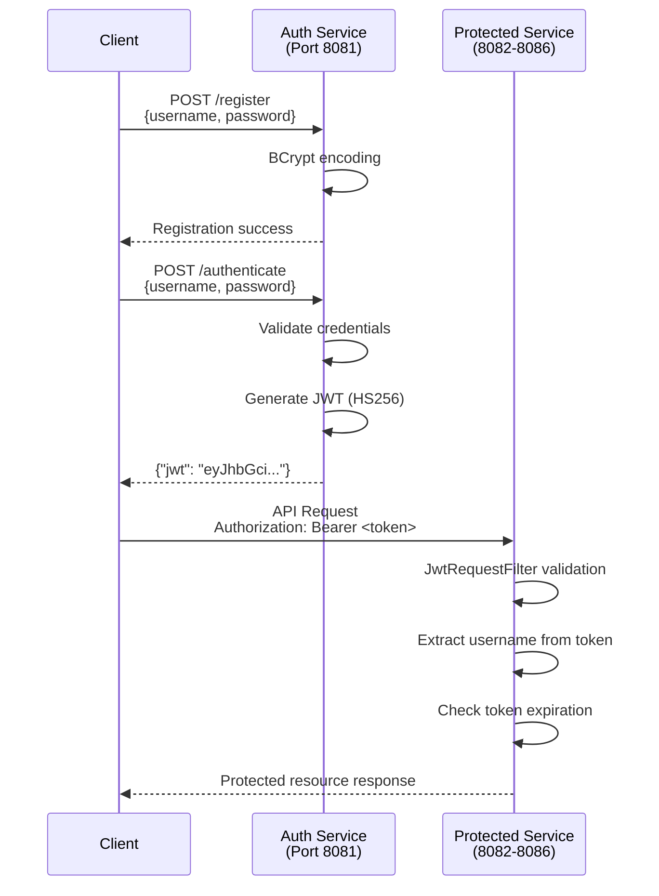

# 📚 GlobalBooks

[](https://www.oracle.com/java/)
[](https://spring.io/projects/spring-boot)
[](https://spring.io/projects/spring-ws)
[](https://www.rabbitmq.com/)
[](https://maven.apache.org/)

## 🏗️ Architecture Overview

GlobalBooks SOA implements a distributed microservices architecture with the following key components:



## 🚀 Key Features

### 🔧 **Dual Protocol Support**
- **REST APIs** for modern web applications with JSON payloads
- **SOAP Web Services** for enterprise integration with XML messaging
- Contract-first SOAP development with WSDL and XSD schemas

### 🛡️ **Security & Authentication**
- **JWT-based authentication** for REST endpoints with BCrypt password encoding
- **Token-based authorization** with configurable expiration (10 hours default)
- **User registration and authentication management** with H2 in-memory database
- **WS-Security** for SOAP endpoints with Username Token authentication
- **Dual authentication model** - JWT for REST, WS-Security for SOAP
- **Spring Security** integration with stateless session management

### 📨 **Asynchronous Processing**
- Event-driven architecture with RabbitMQ message broker
- Reliable message queuing for order processing workflows
- Decoupled microservices communication

### 🔄 **Service Orchestration**
- Centralized business process management
- Multi-step order processing workflows
- Integration with catalog, payment, and shipping services

### 🧪 **Comprehensive Testing**
- Automated test suite for all services
- REST and SOAP endpoint validation
- End-to-end workflow testing

## 🏢 Service Components

| Service | Port | Protocols | Description |
|---------|------|-----------|-------------|
| **Auth Server** | 8081 | REST | User authentication and JWT token management |
| **Orders Service** | 8082 | REST | Order lifecycle management and persistence |
| **Payments Service** | 8083 | REST | Payment processing and transaction handling |
| **Shipping Service** | 8084 | REST | Shipment tracking and logistics management |
| **Catalog Service** | 8085 | REST + SOAP | Book catalog and inventory management |
| **Order Orchestration** | 8086 | REST + SOAP | Business process orchestration and workflows |

## 📋 Prerequisites

### **Software Requirements**

| Software | Version | Required | Notes |
|----------|---------|----------|-------|
| **Java JDK** | 8+ | ✅ **Required** | Oracle JDK or OpenJDK |
| **Apache Maven** | 3.6+ | ✅ **Required** | For building and dependency management |
| **Docker** | 20.0+ | ✅ **Required** | For RabbitMQ message broker |
| **Docker Compose** | 1.29+ | ✅ **Required** | For orchestrating containers |
| **Git** | 2.0+ | ✅ **Required** | For version control |

### **System Requirements**

- **Memory**: Minimum 4GB RAM (8GB recommended)
- **Storage**: 2GB free disk space
- **Network**: Ports 8080-8086, 5672, 15672 available
- **OS**: Windows 10+, macOS 10.14+, Linux (Ubuntu 18.04+)

### **Development Tools (Optional)**

- **IDE**: IntelliJ IDEA, Eclipse, or VS Code
- **API Testing**: Postman, Insomnia, or curl
- **SOAP Testing**: SoapUI or similar SOAP client

## 🚀 Quick Start

### 1. **Clone the Repository**
```bash
git clone https://github.com/Chamal1120/globalbooks-soa.git
cd globalbooks-soa
```

### 2. **Start Message Broker**
```bash
# Start RabbitMQ with Docker Compose
docker-compose up -d rabbitmq

# Verify RabbitMQ is running
curl -u guest:guest http://localhost:15672/api/overview
```

### 3. **Build All Services**
```bash
# Clean and build all microservices
mvn clean install -DskipTests

# Verify build success
ls -la */target/*.jar
```

### 4. **Start All Services**

Open **6 separate terminals** and run each service:

```bash
# Terminal 1: Auth Server
mvn spring-boot:run -pl auth-server -Dspring-boot.run.arguments=--server.port=8081

# Terminal 2: Orders Service  
mvn spring-boot:run -pl orders-service -Dspring-boot.run.arguments=--server.port=8082

# Terminal 3: Payments Service
mvn spring-boot:run -pl payments-service -Dspring-boot.run.arguments=--server.port=8083

# Terminal 4: Shipping Service
mvn spring-boot:run -pl shipping-service -Dspring-boot.run.arguments=--server.port=8084

# Terminal 5: Catalog Service (REST + SOAP)
mvn spring-boot:run -pl catalog-service -Dspring-boot.run.arguments=--server.port=8085

# Terminal 6: Order Orchestration (REST + SOAP)
mvn spring-boot:run -pl order-orchestration-service -Dspring-boot.run.arguments=--server.port=8086
```

### 5. **Verify Services are Running**
```bash
# Check all services health
curl http://localhost:8081/actuator/health  # Auth Server
curl http://localhost:8082/health           # Orders Service
curl http://localhost:8083/health           # Payments Service
curl http://localhost:8084/health           # Shipping Service  
curl http://localhost:8085/health           # Catalog Service
curl http://localhost:8086/actuator/health  # Orchestration Service
```

### 6. **Run Tests**
```bash
# Make test scripts executable
chmod +x tests/*.sh

# Run complete test suite
./tests/run-all-tests.sh
```

## 🔐 Authentication Architecture

### **Current Implementation Status**

| Protocol | Security Status | Authentication Method | Details |
|----------|----------------|----------------------|---------|
| **REST APIs** | ✅ **Secured** | JWT Bearer Tokens | Spring Security + BCrypt |
| **SOAP Services** | ✅ **Secured** | WS-Security Username Token | WSS4J2 Interceptors |

### **JWT Authentication Flow**



### **Security Features**

#### **🔒 JWT Token Security**
- **Algorithm**: HS256 (HMAC with SHA-256)
- **Secret Key**: Auto-generated `SecretKey` for signing
- **Expiration**: 10 hours (36,000,000 ms)
- **Claims**: Subject (username), issued-at, expiration
- **Stateless**: No server-side session storage

#### **🛡️ Password Security**
- **Encoding**: BCrypt with Spring Security defaults
- **Storage**: H2 in-memory database (development)
- **Validation**: Username/password authentication manager

#### **🔧 REST Endpoint Protection**
- **Protected**: All endpoints except `/authenticate`, `/register`, `/health`
- **Filter**: `JwtRequestFilter` extends `OncePerRequestFilter`
- **Header**: `Authorization: Bearer <jwt_token>`
- **Context**: `SecurityContextHolder` authentication

#### **🔐 SOAP WS-Security**
- **Status**: Secured with Username Token authentication
- **Credentials**: Service-specific hardcoded credentials for development
- **Implementation**: WSS4J2 interceptors with password validation
- **Access**: Requires valid Username/Password in SOAP header

### **WS-Security Credentials**

| Service | Endpoint | Username | Password |
|---------|----------|----------|----------|
| **Catalog Service** | `/ws/catalog` | `catalog-client` | `catalog-secure-2024` |
| **Order Orchestration** | `/ws/order-process` | `order-client` | `order-secure-2024` |

### **Authentication Endpoints**

```bash
# User Registration
curl -X POST http://localhost:8081/register \
  -H "Content-Type: application/json" \
  -d '{"username": "newuser", "password": "securepass"}'

# User Authentication  
curl -X POST http://localhost:8081/authenticate \
  -H "Content-Type: application/json" \
  -d '{"username": "newuser", "password": "securepass"}'

# Response format
{
  "jwt": "eyJhbGciOiJIUzI1NiJ9.eyJzdWIiOiJuZXd1c2VyIiwiaWF0IjoxNzU2ODUxNDg3LCJleHAiOjE3NTY4ODc0ODd9.signature"
}
```

## 🧪 Testing the System

### **Quick API Test**
```bash
# 1. Register a new user
curl -X POST http://localhost:8081/register \
  -H "Content-Type: application/json" \
  -d '{"username": "testuser", "password": "password"}'

# 2. Authenticate and get JWT token
JWT_RESPONSE=$(curl -s -X POST http://localhost:8081/authenticate \
  -H "Content-Type: application/json" \
  -d '{"username": "testuser", "password": "password"}')

JWT_TOKEN=$(echo "$JWT_RESPONSE" | grep -o '"jwt":"[^"]*"' | cut -d'"' -f4)

# 3. Process an order via REST
curl -X POST http://localhost:8086/api/orders/process \
  -H "Content-Type: application/json" \
  -H "Authorization: Bearer $JWT_TOKEN" \
  -d '{
    "customerId": "testuser",
    "bookId": "1",
    "quantity": 1
  }'

# 4. Test SOAP endpoint with WS-Security
curl -X POST http://localhost:8085/ws/catalog \
  -H "Content-Type: text/xml; charset=utf-8" \
  -d '<?xml version="1.0" encoding="UTF-8"?>
<soap:Envelope xmlns:soap="http://schemas.xmlsoap.org/soap/envelope/">
   <soap:Header>
      <wsse:Security xmlns:wsse="http://docs.oasis-open.org/wss/2004/01/oasis-200401-wss-wssecurity-secext-1.0.xsd">
         <wsse:UsernameToken>
            <wsse:Username>catalog-client</wsse:Username>
            <wsse:Password Type="http://docs.oasis-open.org/wss/2004/01/oasis-200401-wss-username-token-profile-1.0#PasswordText">catalog-secure-2024</wsse:Password>
         </wsse:UsernameToken>
      </wsse:Security>
   </soap:Header>
   <soap:Body>
      <getBookDetailsRequest xmlns="http://globalbooks.com/catalog">
         <id>1</id>
      </getBookDetailsRequest>
   </soap:Body>
</soap:Envelope>'
```

## 📚 Documentation

### **API Reference**
- **[📋 Complete API Documentation](other-guides/api-endpoints.md)** - Comprehensive REST and SOAP endpoint reference
- **[🔄 Order Processing Walkthrough](other-guides/order-process-walkthrough.md)** - Step-by-step order flow documentation
- **[🧪 Test Suite Documentation](tests/README.md)** - Testing guide and automated test scripts

### **WSDL Documents**
- **Catalog Service**: http://localhost:8085/ws/catalog.wsdl
- **Order Orchestration**: http://localhost:8086/ws/order-process.wsdl

### **Management Interfaces**
- **RabbitMQ Management**: http://localhost:15672 (guest/guest)
- **Service Health Checks**: Available on `/health` or `/actuator/health` endpoints

## 🛠️ Development

### **Building Individual Services**
```bash
# Build specific service
mvn clean package -pl catalog-service

# Run specific service in development mode
mvn spring-boot:run -pl catalog-service -Dspring-boot.run.arguments=--server.port=8085
```

### **Debugging**
```bash
# Run with debug mode enabled
mvn spring-boot:run -pl auth-server -Dspring-boot.run.arguments="--server.port=8081 --debug"

# View service logs
tail -f logs/auth-server.log
```

### **Code Generation (SOAP)**
```bash
# Regenerate JAXB classes from XSD
mvn clean compile -pl catalog-service
```

## 🌐 Technology Stack

### **Core Frameworks**
- **[Spring Boot 2.7.17](https://spring.io/projects/spring-boot)** - Application framework and auto-configuration
- **[Spring WS](https://spring.io/projects/spring-ws)** - Contract-first SOAP web services
- **[Spring Integration](https://spring.io/projects/spring-integration)** - Enterprise integration patterns
- **[Spring Security](https://spring.io/projects/spring-security)** - Authentication and authorization

### **Messaging & Communication**
- **[RabbitMQ](https://www.rabbitmq.com/)** - Message broker for asynchronous communication
- **[AMQP](https://www.amqp.org/)** - Advanced Message Queuing Protocol
- **REST with JSON** - Modern API communication
- **SOAP with XML** - Enterprise web services

### **Build & Development**
- **[Maven](https://maven.apache.org/)** - Multi-module project management
- **[JAXB](https://javaee.github.io/jaxb-v2/)** - XML binding for SOAP services
- **[Docker](https://www.docker.com/)** - Containerization for dependencies

## 📊 Service Metrics

### **Performance Characteristics**
- **Startup Time**: ~30-45 seconds for all services
- **Memory Usage**: ~150-200MB per service
- **Throughput**: 100+ concurrent requests per service
- **Response Time**: <200ms for standard operations

### **Scalability Features**
- Stateless service design for horizontal scaling
- Message queue-based async processing
- Independent service deployments
- Load balancer ready architecture

## 🔧 Configuration

### **Environment Variables**
```bash
# Service URLs (override in application.properties)
export SERVICES_AUTH_URL=http://localhost:8081
export SERVICES_ORDERS_URL=http://localhost:8082
export SERVICES_CATALOG_URL=http://localhost:8085

# RabbitMQ Configuration
export SPRING_RABBITMQ_HOST=localhost
export SPRING_RABBITMQ_PORT=5672
export SPRING_RABBITMQ_USERNAME=guest
export SPRING_RABBITMQ_PASSWORD=guest
```

### **Application Properties**
Each service can be configured via `application.properties`:
```properties
# Example: auth-server/src/main/resources/application.properties
server.port=8081
jwt.secret=mySecretKey
jwt.expiration=36000000
```

## 🚨 Troubleshooting

### **Common Issues**

| Issue | Solution |
|-------|----------|
| **Port already in use** | `lsof -ti:8081 \| xargs kill -9` |
| **RabbitMQ connection failed** | `docker-compose restart rabbitmq` |
| **Service won't start** | Check logs in `logs/` directory |
| **SOAP parsing errors** | Verify XML namespace and structure |
| **JWT token expired** | Re-authenticate to get new token |

### **Health Checks**
```bash
# Quick service status check
./scripts/check-services.sh

# Or manual verification
ps aux | grep java | grep globalbooks
```

## 📈 Roadmap

### **Planned Features**
- [ ] **Docker Compose** for complete service orchestration
- [ ] **API Gateway** with rate limiting and load balancing  
- [ ] **Service Discovery** with Eureka or Consul
- [ ] **Distributed Tracing** with Zipkin or Jaeger
- [ ] **Metrics & Monitoring** with Prometheus and Grafana
- [ ] **Configuration Management** with Spring Cloud Config

### **Enhancements**
- [ ] **Database Integration** with JPA and PostgreSQL
- [ ] **Caching Layer** with Redis
- [ ] **Event Sourcing** for audit trails
- [ ] **Circuit Breaker** pattern implementation
- [ ] **OAuth2** integration for advanced security

